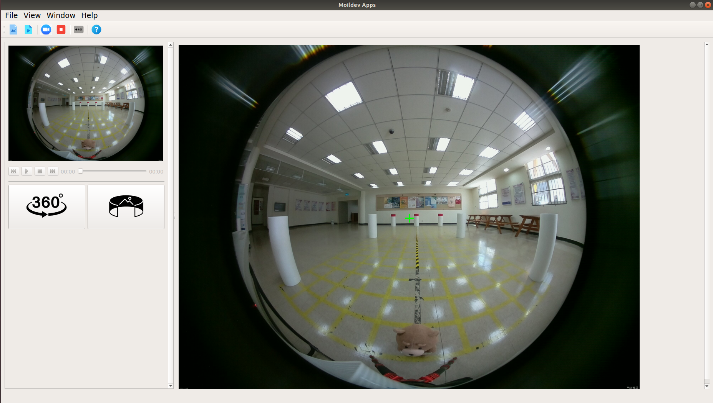
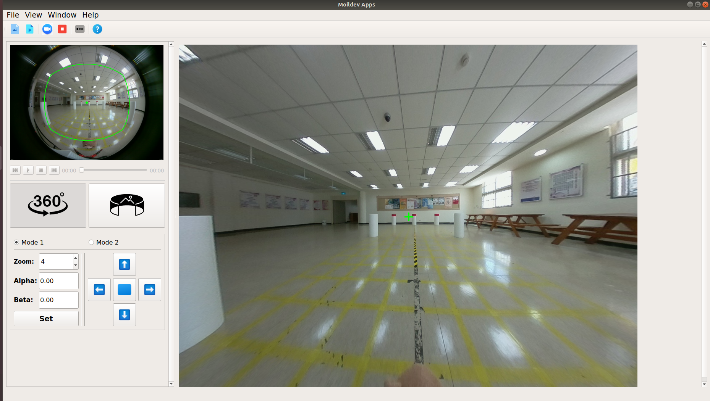
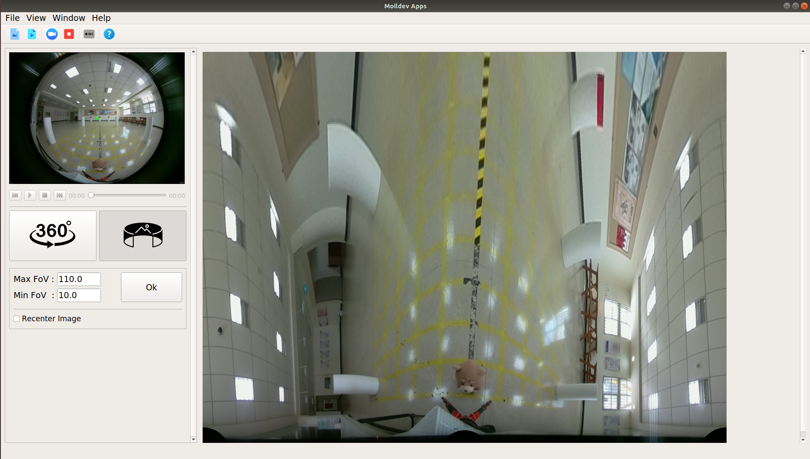

## Moildev Application

##### Project name: Moildev Application

##### Writer : Haryanto

##### Start date: 01/03/2021

- #### Introduction 

  The primary purpose of development Moildev-apps is to provide apps that can implement the Moildev-SDK to process fisheye image. This app can use to provide panorama image and Anypoint view.

- #### The reason why create this project

  We try to make an application that can easy to deployment or running on another computer `without suffering in installation`. user just need to download the executable file from [release](https://github.com/MoilOrg/Moildev-Applications/releases/tag/v1.0) and install it.

- #### Requirement

  this project was developt based on python3 and use such kind of library following:

  ```
  setuptools==39.0.1
  numpy==1.18.1
  opencv-python==4.2.0.34
  PyQt5==5.9.2
  PyQt5-stubs==5.15.2.0
  Moildev
  ```

- #### How to run or contribute

  - Clone this repository

    ```
    $ git clone https://github.com/MoilOrg/Moildev-Applications.git
    ```

  - Open the directory

    ```
    $ cd Moildev-Applications
    ```

  - install requiretment

    ```
    $ pip install -r Requirement.txt
    ```

  - The runing project

    ```
    $ pyhton MoildevApps/main.py
    ```

Here we provide [the release version](https://github.com/MoilOrg/Moildev-Applications/releases/tag/v1.0) for linux OS,  You can install it.

- #### Example result

  Picture bellow this is the example user interface (Apps) result of Moildev Application.

  1. Normal image

  

  2. Anypoint View

  

  3. Panorama View

  

- #### Reference 

  - [Packaging PyQt5 apps with fbs](https://www.learnpyqt.com/tutorials/packaging-pyqt5-apps-fbs/)
  - [fman build system](https://build-system.fman.io/manual/)

  
*anto112*